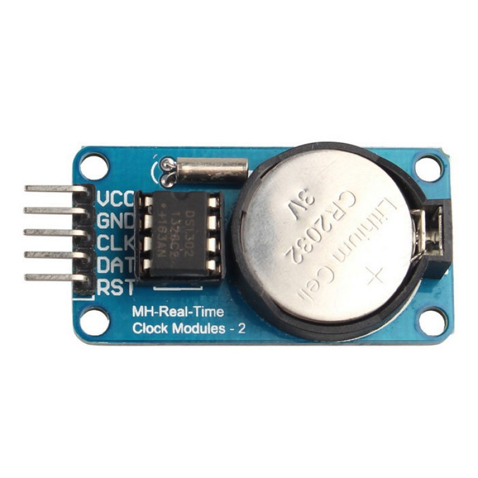
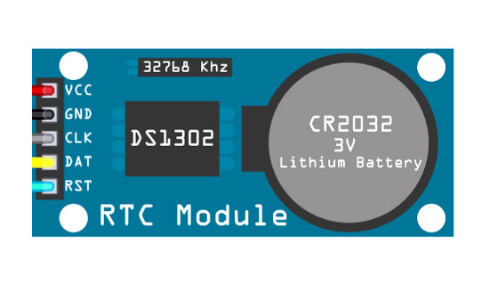

# DS1302-RTC
The DS1302 trickle-charge timekeeping chip contains a real-time clock/calendar and 31 bytes of static RAM. It communicates with a microprocessor via a simple serial interface. The real-time clock/calendar provides seconds, minutes, hours, day, date, month, and year information. The end of the month date is automatically adjusted for months with fewer than 31 days, including corrections for leap year. The clock operates in either the 24-hour or 12-hour format with an AM/PM indicator. 

Interfacing the DS1302 with a microprocessor is simplified by using synchronous serial communication. Only three wires are required to communicate with the clock/RAM: CE, I/O (data line), and SCLK (serial clock). Data can be transferred to and from the clock/RAM 1 byte at a time or in a burst of up to 31 bytes. 

The DS1302 is designed to operate on very low power and retain data and clock information on less than 1µW. The DS1302 is the successor to the DS1202. In addition to the basic timekeeping functions of the DS1202, the DS1302 has the additional features of dual power pins for primary and backup power supplies, programmable trickle charger for VCC1, and seven additional bytes of scratchpad memory.

# OSCILLATOR CIRCUIT
The DS1302 uses an external 32.768kHz crystal. The oscillator circuit does not require any external resistors or
capacitors to operate. Table 1 specifies several crystal parameters for the external crystal. Figure 1 shows a
functional schematic of the oscillator circuit. If using a crystal with the specified characteristics, the startup time is
usually less than one second.

# CLOCK ACCURACY
The accuracy of the clock is dependent upon the accuracy of the crystal and the accuracy of the match between
the capacitive load of the oscillator circuit and the capacitive load for which the crystal was trimmed. Additional
error will be added by crystal frequency drift caused by temperature shifts. External circuit noise coupled into the
oscillator circuit may result in the clock running fast. Figure 2 shows a typical PC board layout for isolating the
crystal and oscillator from noise. Refer to Application Note 58: Crystal Considerations for Dallas Real-Time Clocks
for detailed information.

